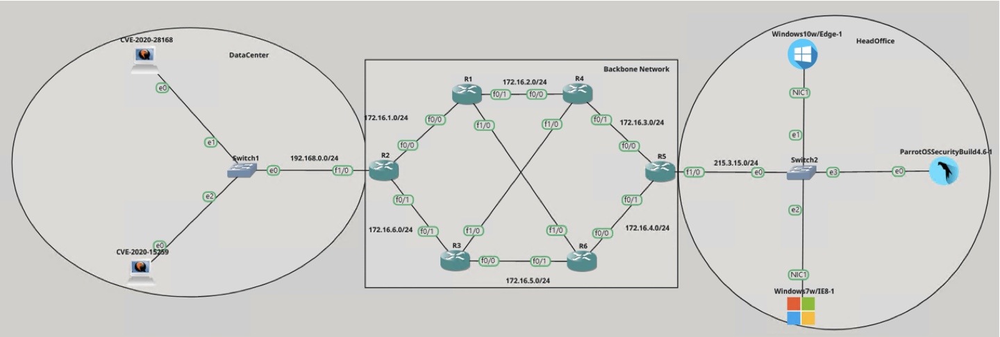
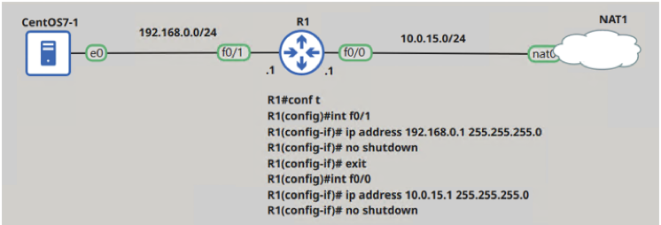

# Q1: Please share your github link and example projects that demonstrate your expertise

## Security Practical Platform
This is my own project in the first company aiming at automatically building a vulnerable lab for security practice in simple way using on-premise system. This project is written by Python, using SDK and Network framework to connect with each endpoint. The frontend customize from GNS3 web-client to be able to call API server.

*Noted: Architecture has been design to fit with resources, business of company in that time* 



We have 3 parts of this platform:

1) As we know GNS3 (Graphical Networking Simulator 3) is a platform provide us environment to bring up a network same as in practice. GNS3 is the best platform for any kind of networking student who looks for cheapest way to learn about system networking from beginner to advanced level, I use it as the core networking component of this Platform. 

2) For the system emulation, I use the QEMU - a free and open-source emulator. We can easily import disk image of which operation system we need for the vulnerable environment as realistic as possible. The advantage of simulator is its lightweight compared to virtualization system, so we can bring up the complex topology with minimum resources requirements.

3) All of these core components I mentioned above are what we can easily download and install in our system. The Provision API server is the main part that connects the system and network together with simple GUI interact on website. Think about having pretty complex topology and each component we need to access into those devices for the configuration, it will take our whole day to bring up just one single lab with lots of efforts (install new OS which is vulnerable, install vulnerable package, config the networking device with tons of different commands for each vendor (Cisco, Juniper, etc ...)). The Provision API server helps us reduce time on repeating boring configuration which is not the main purpose of Security engineer.

|| 
|:--:|
|*Not waste time anymore remembering tons of command lines nor manual installation step*|
<br/>

### System Diagram


<br/>

### Project structure:
```
Security Platform
├── api
│   ├── configs
│   │   ├── *.conf
│   ├── network
│   │   ├─Cisco
│   │   │ ├── router.py
│   │   │ ├── switch.py
│   │   │ ├── firewall.py
│   │   │ ├── ...
│   │   │ ├── <device_name>.py
│   │   │ ├── switch.py
│   │   ├── *.conf
│   │   ├─Juniper
│   │   ├─...
│   │   ├─Vendors
│   ├── system
│   │   ├─window.py
│   │   ├─linux.py
│   │   ├─unix.py
│   ├── oss
│   ├── main.py
├── web-ui
│   ├── css
│   │   ├── **/*.css
│   ├── images
│   ├── js
│   ├── index.html
├── dist (or build)
├── node_modules
├── package.json
├── package-lock.json 
└── .gitignore
```
<br/>

### TechStacks
GNS3, QEMU, Python, Nodejs, NginX