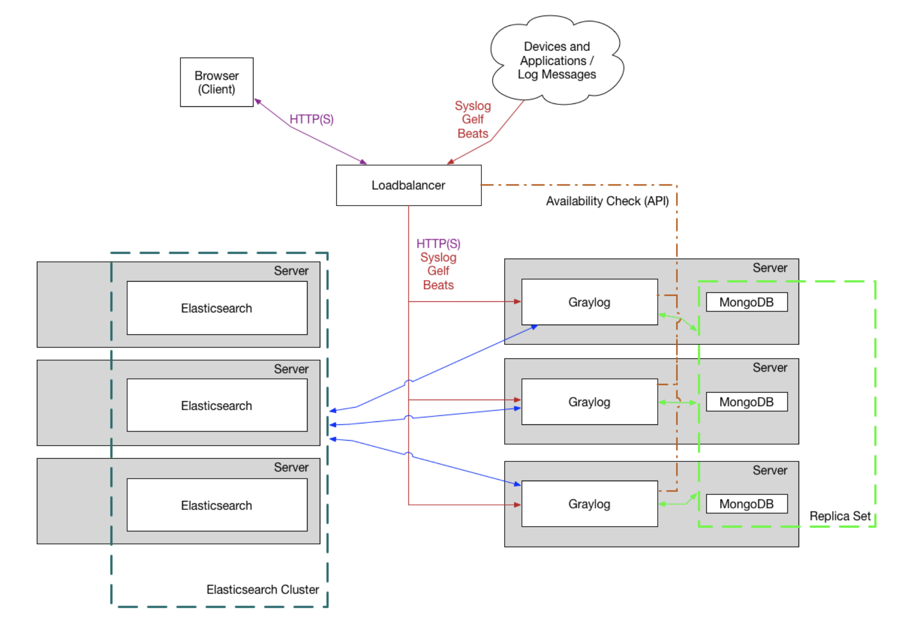

# Q3: Please describe a system you deployed in production that had performance issue and how you diagnosed and optimized the performance

I've installed Graylog cluster to catch log from our microservices. At first everything was fine but one day the log timestamp on dashboard was later than the timestamp of the real log. We wanted our graylog to be able to have the latest log as real time system so that 5min log timestamp delay is unacceptable for us. Graylog is a good fit for debugging microservice in production in that time especially for on-premise system:

Debugging follow these step:
1. Check resources: As usual, ElasticSearch cluster hunger for Ram for better performance. I wrote a mini script to index sample data directly to ElasticSearch without going through Graylog or Load Balancer. The index still immediately showed up when I query => This is not the main issue
2. The MongoDB only use for storing meta information and configuration data and doesn’t need many resources => Not the root cause too
3. Check from the Load Balancer, HA Proxy log didn't have any suspect log. Resources did not consume too much in node and the dashboard looked good => Not the issue
4. Now to the Graylog, same for 3 components above. Resources did not hang too much, but strange things showed up when I try to push sample logs: 2 nodes got it very fast and log pumped up right after that on Graylog dashboard, except for the last node. It took 5mins after that to appear on the board => This node is the main reason
5. How to check it? Log didn't have any matter, configuration file of this node and 2 others were nothing different. Resources didn't matter too so I started to check the network, Iperf to test bandwidth between Load Balancer with both big packet and small packet were still good. So what happened here? I realized the time on the VM was later than global time 5 min, so when we access the dashboard through the Load Balancer, it was bound to this delay node as the main node and not routing to another node. After setting up the HA proxy to route among 3 node graylog and fixing the time issue, the log didn't delay anymore.

I realized that sometimes the issue didn't just come from some casual reason as usual like resources, misconfiguration or network. It may come from some unexpected aspects that we barely aware of it like environment, so we need to have an open mindset to debug issue.